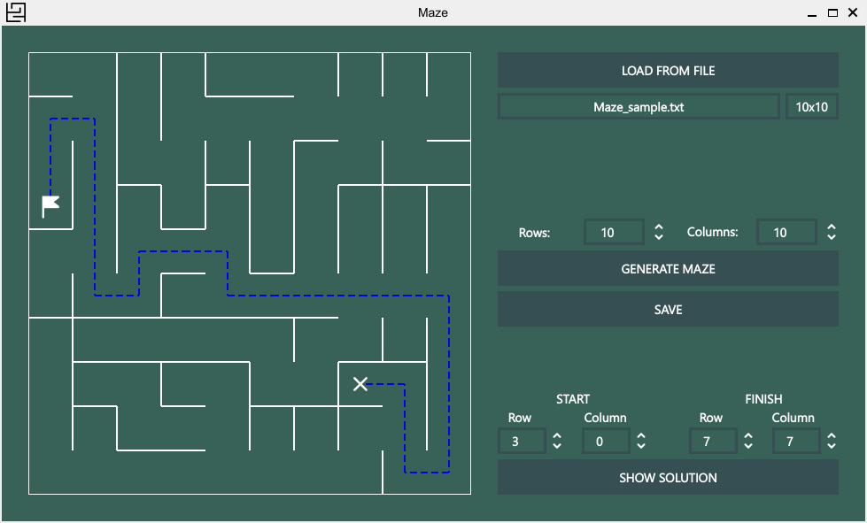

# Maze

## Описание
Реализация программы Maze, которая позволяет отрисовывать и генерировать идеальные лабиринты на основе алгоритма Эллера



## Возможности

- Загрузка лабиринта из файла, который задается в следующем формате:
```
4 4
0 0 0 1
1 0 1 1
0 1 0 1
0 0 0 1

1 0 1 0
0 0 1 0
1 1 0 1
1 1 1 1
```
Первые два числа обозначают число строк и столбцов, в первой матрице отображается наличие стены справа от каждой ячейки, а во второй — снизу.

- Максимальный размер лабиринта — 50х50.

-  Генерация идеального лабиринта по алгоритму Эллера. Идеальный лабиринт не содержит изолированных областей и петель и имеет только 1 вариант решения.

-  Решение любого лабиринта, который отображается в текущий момент. Необходимо указать начальную и конечную точки.

## Технические требования

- С++20;
- Qt 5.15 и выше;
- CMake 3.5 и выше.


## Основные команды

Установка:
```bash
  make install
```  
Запуск:
```bash
  make run
```  
Удаление:
```bash
  make uninstall
```  

## Авторы

School 21 students: 

- [Buggkell](https://t.me/a_a_sorokina)
- [Montoyay](https://t.me/tdutanton)

